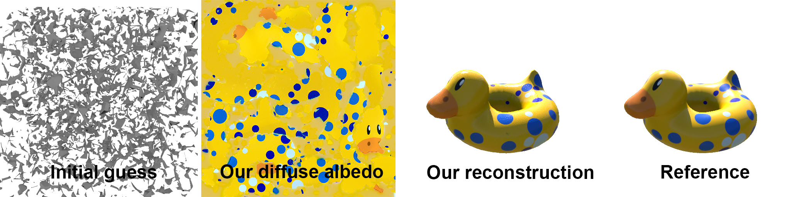
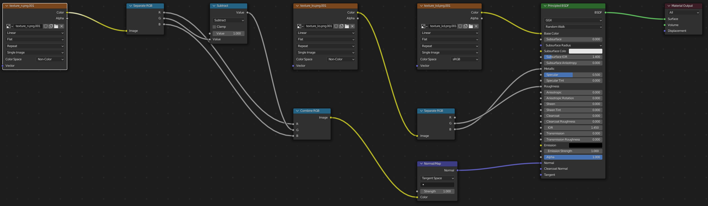

# nvdiffrecmc (NeurIPS 2022)

## Official PyTorch implementation


Joint optimization of topology, materials and lighting from multi-view image observations 
as described in the paper
[Shape, Light, and Material Decomposition from Images using Monte Carlo Rendering and Denoising](https://nvlabs.github.io/nvdiffrecmc/) (NeurIPS 2022).


# Licenses

Copyright &copy; 2022, NVIDIA Corporation & Affiliates. All rights reserved.

This work is made available under the [Nvidia Source Code License](https://github.com/NVlabs/nvdiffrecmc/blob/main/LICENSE.txt).

For business inquiries, please visit our website and submit the form: [NVIDIA Research Licensing](https://www.nvidia.com/en-us/research/inquiries/).

# Installation

Requires Python 3.6+, VS2019+, Cuda 11.3+ and PyTorch 1.10+, and an 
NVIDIA GPU with a modern driver supporting OptiX 7.3 or newer.

Tested in Anaconda3 with Python 3.9 and PyTorch 1.12 on the following GPUs: V100, RTX3090, and A6000. 

## One time setup

Install the [Cuda toolkit](https://developer.nvidia.com/cuda-toolkit) (required to build the PyTorch extensions).
We support Cuda 11.3 and above.
Pick the appropriate version of PyTorch compatible with the installed Cuda toolkit.
Below is an example with Cuda 11.6

```
conda create -n dmodel python=3.9
activate dmodel
conda install pytorch torchvision torchaudio cudatoolkit=11.6 -c pytorch -c conda-forge
pip install ninja imageio PyOpenGL glfw xatlas gdown
pip install git+https://github.com/NVlabs/nvdiffrast/
pip install --global-option="--no-networks" git+https://github.com/NVlabs/tiny-cuda-nn#subdirectory=bindings/torch
imageio_download_bin freeimage
```

### Every new command prompt
`activate dmodel`

# Examples

*Our approach is designed for high-end NVIDIA GPUs with large amounts of memory.
To run on mid-range GPU's, reduce the batch size parameter in the .json files.*

Simple genus 1 reconstruction example:
```
python train.py --config configs/bob.json
```
Visualize training progress (only supported on Windows):
```
python train.py --config configs/bob.json --display-interval 20
```

Below, we show the starting point, our extracted diffuse albedo texture, 
our final result and the reference. 



The results will be stored in the `out` folder.
The [Spot](http://www.cs.cmu.edu/~kmcrane/Projects/ModelRepository/index.html#spot) and
[Bob](https://www.cs.cmu.edu/~kmcrane/Projects/ModelRepository/index.html) models were
created and released into the public domain by [Keenan Crane](http://www.cs.cmu.edu/~kmcrane/index.html).

Included examples

- `spot.json` - Extracting a 3D model of the spot model. Geometry, materials, and lighting from image observations.
- `spot_metal.json` - Example of joint learning of materials and high frequency environment lighting 
- `bob.json` - Simple example of a genus 1 model.

# Datasets

We additionally include configs (`nerf_*.json`, `nerd_*.json`) to reproduce the main results of the paper. We rely on third party datasets, which
are courtesy of their respective authors. Please note
that individual licenses apply to each dataset. To automatically download and pre-process the NeRF and NeRD datasets, run the `download_datasets.py` script (note that the NeRFactor dataset is large (~10GB)):
```
activate dmodel
cd data
python download_datasets.py
```
Below follows more information and instructions on how to manually install the datasets (in case the automated script fails). Note that the NeRFactor dataset is large (~10GB). 

**NeRF synthetic dataset** Our view interpolation results use the synthetic dataset from the original [NeRF](https://github.com/bmild/nerf) paper.
To manually install it, download the [NeRF synthetic dataset archive](https://drive.google.com/uc?export=download&id=18JxhpWD-4ZmuFKLzKlAw-w5PpzZxXOcG)
and unzip it into the `nvdiffrec/data` folder. This is required for running any of the `nerf_*.json` configs.

**NeRD dataset** We use a dataset from the [NeRD](https://markboss.me/publication/2021-nerd/) paper, which features real-world photogrammetry and inaccurate
(manually annotated) segmentation masks. Clone the NeRD datasets using git and rescale them to 512 x 512 pixels resolution using the script
`scale_images.py`. This is required for running the `nerd_gold.json` config.   
```
activate dmodel
cd nvdiffrec/data/nerd
git clone https://github.com/vork/moldGoldCape.git
python scale_images.py
```

**NeRFactor dataset** We use datasets from the [NeRFactor](https://xiuming.info/projects/nerfactor/) paper, which features 
a simplified version of a subset of the NeRF Synthetic dataset (low frequency lighting). Download the NeRFactor datasets from their [Google Drive](https://drive.google.com/drive/folders/1wTX6RuifMCe2xvyk00dlBSsKxO_vuwlp). This is required for running any of the `nerfactor_*.json` configs. The four datasets should be placed in the folders `data\nerfactor\hotdog_2163`, `data\nerfactor\drums_3072`, `data\nerfactor\ficus_2188`, and `data\nerfactor\lego_3072`.

# Use the extracted 3D models in Blender

We include a script [blender.py](blender/blender.py) that can be used to load our geometry, materials and environment lighting in Blender.
An example of the shading graph is included below



# Server usage (through Docker)

- Build docker image.
```
cd docker
./make_image.sh nvdiffrec:v1
```

- Start an interactive docker container:
`docker run --gpus device=0 -it --rm -v /raid:/raid -it nvdiffrec:v1 bash`

- Detached docker:
`docker run --gpus device=1 -d -v /raid:/raid -w=[path to the code] nvdiffrec:v1 python train.py --config configs/bob.json`
